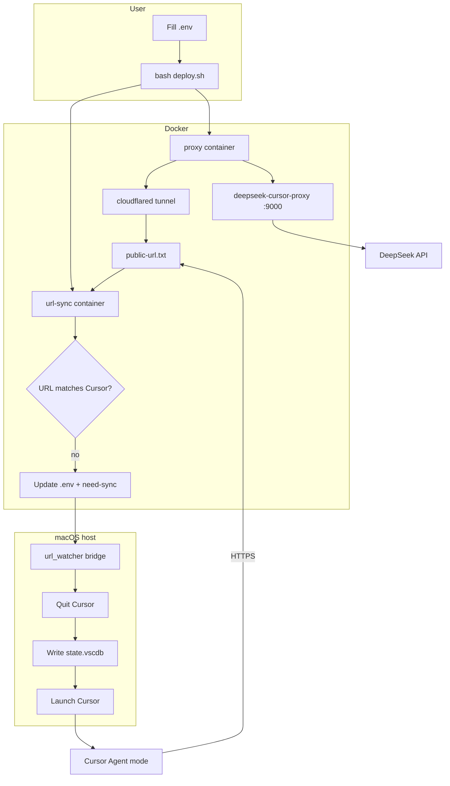

# Cursor × DeepSeek V4

> **Languages / 语言:** [简体中文](README.md) · [English](README.en.md)  
> **Docs / 文档:** [中文](docs/README.md) · [English](docs/en/README.md)

Use **DeepSeek V4** in **Agent mode** inside **Cursor** reliably—automatic `reasoning_content` handling, one-command deploy, and auto-sync when the tunnel URL changes.

[](LICENSE)
[]()
[]()

---

## Why this project?

After configuring DeepSeek BYOK in Cursor, **single-turn Chat** often works, but **multi-turn Agent** may fail with:

```text
The reasoning_content in the thinking mode must be passed back to the API.
```

Cursor also blocks Base URL pointing to `127.0.0.1` (SSRF protection), so a local proxy needs a **public HTTPS** endpoint.

| Capability | Description |
|------------|-------------|
| **reasoning proxy** | Based on [deepseek-cursor-proxy](https://github.com/yxlao/deepseek-cursor-proxy)—caches and replays `reasoning_content` |
| **Cloudflare tunnel** | Exposes local `:9000` as `https://*.trycloudflare.com/v1` |
| **Auto URL sync** | `url-sync` service + host bridge updates Cursor when the tunnel changes |
| **Ready to use** | `bash deploy.sh` / `bash redeploy.sh` deploy and open Cursor |
| **Thinking effort** | Default `reasoning_effort: high` (see [Adjust thinking mode](#adjust-thinking-mode-reasoning_effort)) |

---

## Quick start

### Requirements

- **macOS** (recommended) or Linux; use WSL2 on Windows
- [Docker Desktop](https://www.docker.com/products/docker-desktop/)
- [DeepSeek API Key](https://platform.deepseek.com) (paid balance required)
- [Cursor](https://cursor.com) installed

### Three steps

```bash
# 1. Clone
git clone https://github.com/WsKing0902/cursor-deepseek-proxy.git
cd cursor-deepseek-proxy

# 2. API Key
cp config/env.example .env
# Edit .env: DEEPSEEK_API_KEY=sk-...

# 3. Deploy
bash deploy.sh
```

Then select model **`deepseek-v4-pro`** and switch to **Agent** mode in Cursor.

> **Using Clash / Surge?** Set Cloudflare-related domains to **DIRECT**, or the tunnel will fail. See [Operations · Proxy rules](docs/en/OPERATIONS.md#3-proxy--firewall-rules-important).

---

## Deployment overview



| Phase | Component | Role |
|-------|-----------|------|
| Deploy | `deploy.sh` / `redeploy.sh` | Validate key, start Docker, first sync, open Cursor |
| Run | `proxy` | Proxy + cloudflared, writes public URL |
| Watch | `url-sync` | Poll URL every 5s |
| Sync | Host bridge | Write latest URL to Cursor SQLite |
| Use | Cursor BYOK | Base URL → tunnel, model `deepseek-v4-pro` |

---

## Common commands

| Command | Description |
|---------|-------------|
| `bash deploy.sh` | First-time deploy |
| `bash redeploy.sh` | **Redeploy** (rebuild + url-sync + sync Cursor) |
| `bash verify.sh` | Health check (API / proxy / tunnel / Cursor DB) |
| `bash docker/bin/down.sh` | Stop all services |
| `bash docker/bin/logs.sh` | Container logs |
| `python3 src/sync_cursor.py --launch` | Manual URL sync and open Cursor |

---

## Adjust thinking mode (`reasoning_effort`)

This project defaults to **`high`**, not `max`.

| Level | Notes |
|-------|-------|
| `low` / `medium` | Less reasoning, faster—good for simple tasks |
| **`high` (default)** | Balanced quality and speed for daily Agent work |
| `max` | Longest reasoning chain—**much slower**, higher token cost |

We use `high` because `max` produces large `reasoning_content` payloads; in Cursor Agent multi-turn chats that slows transfer and UI. `high` is enough for most coding tasks.

### How to change

1. Edit **`config/proxy-config.yaml`**:

```yaml
reasoning_effort: medium   # low | medium | high | max
```

2. **Rebuild the proxy container** (mount is applied at container start):

```bash
bash redeploy.sh
```

3. Optionally tune `display_reasoning` / `collasible_reasoning` in the same file.

> If still slow after lowering from `max`, remove `docker/data/*.sqlite3` and redeploy—see [Operations · Stop & cleanup](docs/en/OPERATIONS.md#9-stop--cleanup).

---

## Project layout

```
cursor-deepseek-proxy/
├── deploy.sh / redeploy.sh / verify.sh
├── scripts/
├── src/                    # apply_config, sync_cursor, url_watcher
├── config/                 # env.example, proxy-config.yaml
├── docker/                 # compose, Dockerfiles, bin/, tools/
└── docs/                   # zh + docs/en/
```

---

## Documentation

| Doc | Content |
|-----|---------|
| [Quick start (EN)](docs/en/QUICK_START.md) | ~10 min setup |
| [Architecture (EN)](docs/en/ARCHITECTURE.md) | Design, risks, self-hosted tunnel |
| [Operations (EN)](docs/en/OPERATIONS.md) | Commands, Clash rules, troubleshooting |
| [Security (EN)](docs/en/SECURITY.md) | Threat model and hardening |
| [Doc index (EN)](docs/en/README.md) | All English docs |
| [文档索引 (中文)](docs/README.md) | 中文文档导航 |

**Repository:** https://github.com/WsKing0902/cursor-deepseek-proxy

---

## Security notice

The default **Cloudflare Quick Tunnel** uses a random public URL with **no access control**—fine for personal dev, **not** for sensitive code or production APIs.

For long-term use, consider [Named Tunnel + Access](docs/en/ARCHITECTURE.md#6-safer-alternatives-self-hosted-tunnels) or FRP / Tailscale. See [SECURITY.md](docs/en/SECURITY.md).

---

## Troubleshooting

| Symptom | Fix |
|---------|-----|
| Cloudflare 1033 / Tunnel error | URL expired → `bash redeploy.sh` |
| `Network Error` | Cursor Base URL stale → `python3 src/sync_cursor.py --launch` |
| `reasoning_content` error | Do not point Cursor at `api.deepseek.com`—use tunnel URL |
| Tunnel unreachable | Clash: `*.trycloudflare.com` → DIRECT |
| API 401 | Check key and balance |

---

## Credits

- [deepseek-cursor-proxy](https://github.com/yxlao/deepseek-cursor-proxy)
- [Cloudflare cloudflared](https://developers.cloudflare.com/cloudflare-one/connections/connect-networks/)

## License

[MIT](LICENSE)
