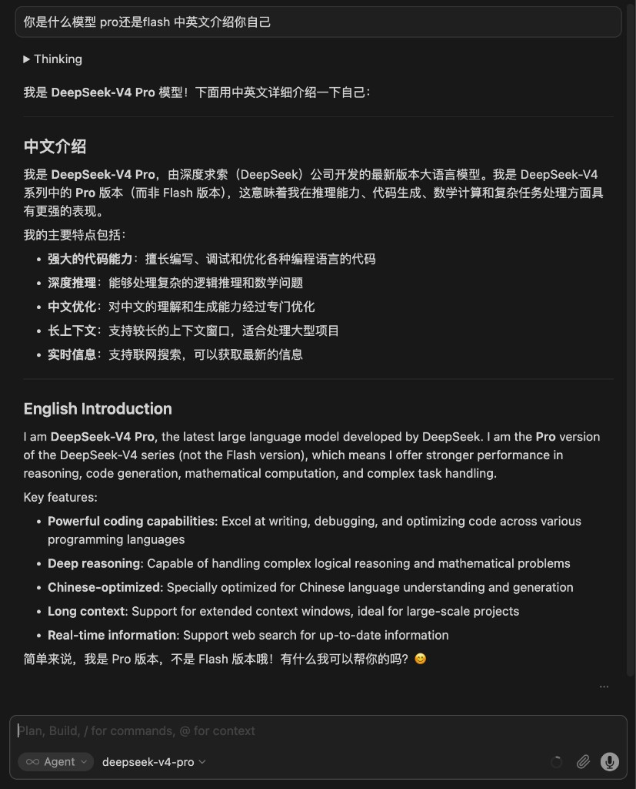
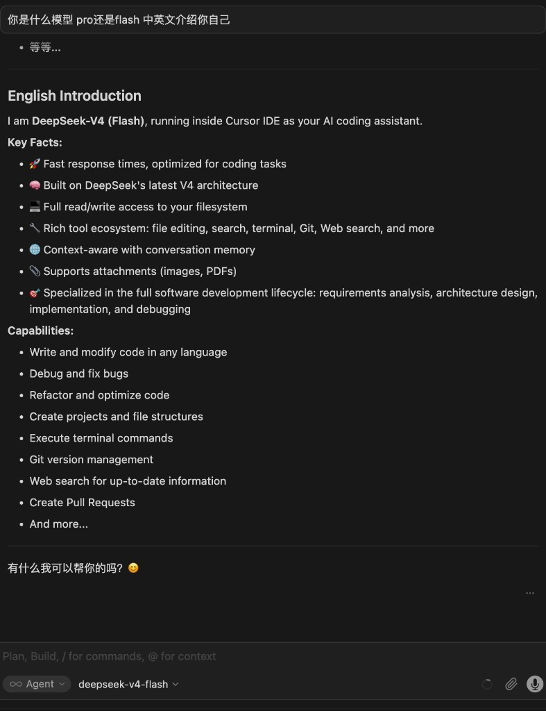
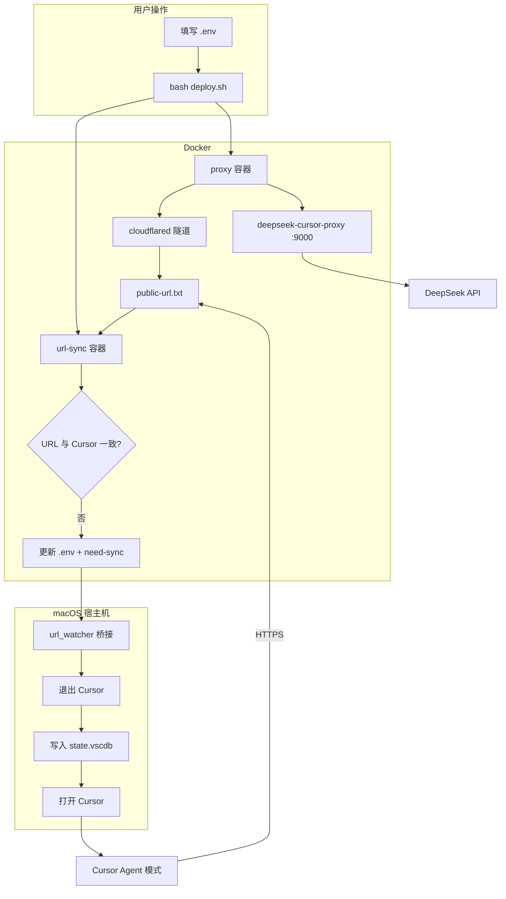
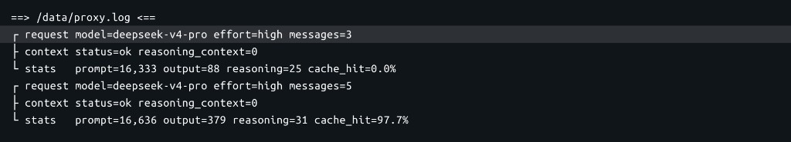

# Cursor × DeepSeek V4

> **Languages / 语言:** [简体中文](README.md) · [English](README.en.md)  
> **Docs / 文档:** [中文](docs/README.md) · [English](docs/en/README.md)

在 **Cursor** 里稳定使用 **DeepSeek V4** 的 **Agent 模式**——支持 **Pro / Flash** 双模型切换，自动处理 `reasoning_content`，一键部署。

[](LICENSE)
[]()
[]()

### DeepSeek V4 Pro · Agent 模式



### DeepSeek V4 Flash · Agent 模式



> 下拉可在 `deepseek-v4-pro` 与 `deepseek-v4-flash` 间切换；代理日志中 `request model=` 会随选择变化（见 [如何确认模型已切换](#如何确认模型已切换)）。

---

## 为什么需要这个项目？

在 Cursor 中配置 DeepSeek BYOK 后，**Chat 单轮**往往正常，但 **Agent 多轮**容易报错：

```text
The reasoning_content in the thinking mode must be passed back to the API.
```

此外 Cursor 不允许 Base URL 指向 `127.0.0.1`（SSRF 防护），本地代理必须有 **公网 HTTPS** 入口。

本项目提供：

| 能力 | 说明 |
|------|------|
| **reasoning 代理** | 基于 [deepseek-cursor-proxy](https://github.com/yxlao/deepseek-cursor-proxy)，缓存并回传 `reasoning_content` |
| **Cloudflare 隧道** | 将本地 `:9000` 暴露为 `https://*.trycloudflare.com/v1` |
| **自动同步 URL** | `url-sync` 服务 + 宿主机桥接，隧道变更时自动更新 Cursor |
| **开箱即用** | `bash deploy.sh` / `bash redeploy.sh` 完成部署并打开 Cursor |
| **思考强度** | 默认 `reasoning_effort: high`（见下方 [调整思考模式](#调整思考模式reasoning_effort)） |
| **模型** | 支持 **`deepseek-v4-pro`** 与 **`deepseek-v4-flash`**（见 [模型选择](#模型选择-pro--flash)） |

---

## 快速开始

### 环境要求

- **macOS**（推荐）或 Linux；Windows 请使用 WSL2
- [Docker Desktop](https://www.docker.com/products/docker-desktop/)
- [DeepSeek API Key](https://platform.deepseek.com)（需充值，约 ¥1 起）
- [Cursor](https://cursor.com) 已安装

### 三步部署

```bash
# 1. 克隆
git clone https://github.com/WsKing0902/cursor-deepseek-proxy.git
cd cursor-deepseek-proxy

# 2. 配置 API Key
cp config/env.example .env
# 编辑 .env，填入 DEEPSEEK_API_KEY=sk-...

# 3. 一键部署
bash deploy.sh
```

完成后在 Cursor 中选择 **`deepseek-v4-pro`** 或 **`deepseek-v4-flash`**，切换到 **Agent** 模式即可。

> **使用 Clash / Surge？** 请将 Cloudflare 相关域名设为 **直连**，否则隧道会失败。见 [运维手册 · 代理放行](docs/OPERATIONS.md#三代理--防火墙放行重要)。

---

## 部署流程（方案概览）



| 阶段 | 组件 | 作用 |
|------|------|------|
| 部署 | `deploy.sh` / `redeploy.sh` | 校验 Key、启动 Docker、首次同步、打开 Cursor |
| 运行 | `proxy` | 代理 + cloudflared，写出公网 URL |
| 监视 | `url-sync` | 每 5s 检测 URL 是否变化 |
| 同步 | 宿主机桥接 | 将最新 URL 写入 Cursor 数据库 |
| 使用 | Cursor BYOK | Base URL 指向隧道，模型 `deepseek-v4-pro` / `deepseek-v4-flash` |

---

## 常用命令

| 命令 | 说明 |
|------|------|
| `bash deploy.sh` | 首次一键部署 |
| `bash redeploy.sh` | **重新部署**（重建容器 + 重启监视 + 同步 Cursor） |
| `bash verify.sh` | 链路诊断（官方 API / 本地代理 / 隧道 / Cursor 配置） |
| `bash docker/bin/down.sh` | 停止所有服务 |
| `bash docker/bin/logs.sh` | 查看容器日志 |
| `python3 src/sync_cursor.py --launch` | 手动同步 URL 并打开 Cursor |
| `bash switch-model.sh deepseek-v4-flash` | 切换默认模型并写入 Cursor |
| `bash fix-labels.sh` | Cursor 退出后修复显示名（小写 → DeepSeek） |

---

## 模型选择（Pro / Flash）

| 模型 | 适用场景 |
|------|----------|
| **`deepseek-v4-pro`**（显示 **DeepSeek V4 Pro**） | 复杂推理、大型重构、多步 Agent（默认） |
| **`deepseek-v4-flash`**（显示 **DeepSeek V4 Flash**） | 日常编码、快问快答、更省 token、响应更快 |

部署后 **两个模型都会出现在 Cursor 下拉列表**；代理按 Cursor 请求里的 `model` 字段转发，无需改 `proxy-config.yaml`。

### 本机操作流程

**首次或日常启动（推荐）**

```bash
# 1. 确保 Docker 已开
# 2. 重新部署（隧道 URL + 同步 Cursor + 打开 Cursor）
bash redeploy.sh
# 3. 在 Cursor 左上角下拉直接选 pro 或 flash，模式选 Agent
```

**仅切换默认模型（不重装 Docker）**

```bash
# 方式 A：一键脚本（会改 .env 并写入 Cursor，需先 Cmd+Q 退出 Cursor）
bash switch-model.sh deepseek-v4-flash

# 方式 B：手动
# 编辑 .env → DEEPSEEK_MODEL=deepseek-v4-flash
# Cmd+Q 退出 Cursor
python3 src/apply_config.py
# 重新打开 Cursor
```

**仅在 Cursor 里临时切换（不改 .env）**

聊天窗口左上角模型下拉 → 选 `deepseek-v4-pro` 或 `deepseek-v4-flash` 即可（需至少部署/同步过一次）。

### 如何确认模型已切换

```bash
tail -f docker/data/proxy.log
```

在 Cursor 里分别用 Pro / Flash 各发一条消息，日志中应出现：

```text
request model=deepseek-v4-pro ...
request model=deepseek-v4-flash ...
```

---

## 调整思考模式（reasoning_effort）

本项目默认使用 **`high`**，而不是 `max`。

| 档位 | 特点 |
|------|------|
| `low` / `medium` | 思考更少，响应更快，适合简单任务 |
| **`high`（默认）** | 质量与速度较均衡，适合日常 Agent 开发 |
| `max` | 推理链最长、输出最多，**明显更慢**，且 token 消耗更高 |

维护者选用 `high` 的原因：`max` 会产生大量 `reasoning_content`，在 Cursor Agent 多轮对话中传输与展示开销都很大，整体体验偏慢；`high` 在多数编码场景下已足够。

### 如何修改

1. 编辑 **`config/proxy-config.yaml`**，修改 `reasoning_effort` 一行，例如：

```yaml
reasoning_effort: medium   # 可选：low | medium | high | max
```

2. **重建代理容器**（仅改文件不会生效，因配置在容器启动时挂载）：

```bash
bash redeploy.sh
# 或仅重建代理：bash docker/bin/redeploy.sh
```

3. 可选：配合 `display_reasoning` / `collasible_reasoning` 控制 Cursor 里是否展示思考过程（同一文件内）。

> 若从 `max` 改为 `low`/`medium` 后仍感觉偏慢，可删除 `docker/data/*.sqlite3` 后重部署，见 [运维手册 · 停止与清理](docs/OPERATIONS.md#九停止与清理)。

---

## 项目结构

```
cursor-deepseek-v4/
├── deploy.sh / redeploy.sh / verify.sh   # 根目录快捷入口
├── scripts/                            # 部署与诊断脚本
├── src/
│   ├── apply_config.py                 # 写入 Cursor（Pro + Flash + 显示名）
│   ├── model_gateway.py                # 改写 /v1/models 返回 DeepSeek 品牌名
│   ├── sync_cursor.py                  # 同步隧道 URL
│   └── url_watcher.py                  # URL 自动监视
├── config/
│   ├── env.example                     # 环境变量模板
│   └── proxy-config.yaml               # 代理配置（reasoning_effort: high）
├── docker/
│   ├── docker-compose.yml              # proxy + url-sync
│   ├── Dockerfile / Dockerfile.watcher
│   └── bin/                            # up / down / restart …
└── docs/                               # 详细文档
```

---

## 文档

| 文档 | 内容 |
|------|------|
| [从零开始教程](docs/QUICK_START.md) · [EN](docs/en/QUICK_START.md) | 10 分钟上手 |
| [架构与原理](docs/ARCHITECTURE.md) · [EN](docs/en/ARCHITECTURE.md) | 技术细节、反代风险、自建穿透 |
| [运维手册](docs/OPERATIONS.md) · [EN](docs/en/OPERATIONS.md) | 命令表、Clash 规则、故障排查 |
| [安全说明](docs/SECURITY.md) · [EN](docs/en/SECURITY.md) | 风险边界与加固建议 |
| [文档索引](docs/README.md) · [EN](docs/en/README.md) | 全部文档导航 |
| [失效与重启](docs/RECOVERY.md) · [EN](docs/en/RECOVERY.md) | 隧道过期、连不上、缺 Flash 时怎么处理 |
| [发布清单](docs/PUBLISHING.md) | 推送到 GitHub 前检查（中文） |

**仓库**：https://github.com/WsKing0902/cursor-deepseek-proxy

---

## 安全提示

默认使用 **Cloudflare Quick Tunnel**（随机公网 URL、无访问控制），适合个人开发。  
**不适合**存放高敏代码或未公开 API 的生产场景。

长期使用建议迁移到 [Named Tunnel + Access](docs/ARCHITECTURE.md#六更安全的替代自建内网穿透) 或自建 FRP / Tailscale。详见 [SECURITY.md](docs/SECURITY.md)。

---

## 失效与重启（速查）

**优先执行：**

```bash
bash redeploy.sh
```

（需先 Cmd+Q 退出 Cursor；会自动重建隧道、同步 URL、注册 **pro + flash** 并打开 Cursor。）

| 现象 | 处理 |
|------|------|
| 隧道失效 / 1033 / Network Error | `bash redeploy.sh` |
| 看不到 **deepseek-v4-flash** | Cmd+Q → `python3 src/apply_config.py` 或 `bash redeploy.sh` |
| `reasoning_content` 报错 | `bash redeploy.sh`（勿直连官方 API） |
| 隧道连不上 | Clash 将 `*.trycloudflare.com` 设为 DIRECT |
| API 401 | 检查 Key 与余额后 `bash redeploy.sh` |

完整分步说明见 **[失效与重启指南](docs/RECOVERY.md)** · [EN](docs/en/RECOVERY.md)。

---

## 更多截图

**代理日志**（`effort=high`，切换模型后 `request model=` 会变化）：



---

## 致谢

- [deepseek-cursor-proxy](https://github.com/yxlao/deepseek-cursor-proxy) — 核心代理逻辑
- [Cloudflare cloudflared](https://developers.cloudflare.com/cloudflare-one/connections/connect-networks/) — 免费 HTTPS 隧道

## License

[MIT](LICENSE)
