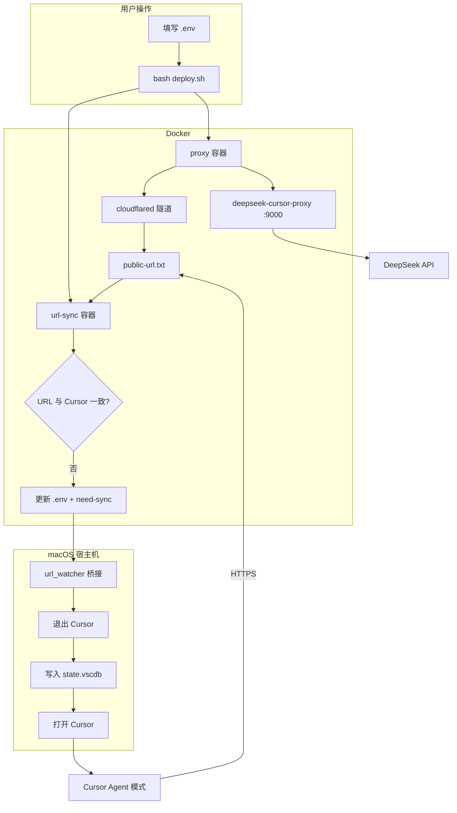

# Cursor × DeepSeek V4

在 **Cursor** 里稳定使用 **DeepSeek V4** 的 **Agent 模式**——自动处理 `reasoning_content`，一键部署，隧道 URL 变化时自动同步 Cursor 配置。

[](LICENSE)
[]()
[]()

---

## 为什么需要这个项目？

在 Cursor 中配置 DeepSeek BYOK 后，**Chat 单轮**往往正常，但 **Agent 多轮**容易报错：

```text
The reasoning_content in the thinking mode must be passed back to the API.
```

此外 Cursor 不允许 Base URL 指向 `127.0.0.1`（SSRF 防护），本地代理必须有 **公网 HTTPS** 入口。

本项目提供：

| 能力 | 说明 |
|------|------|
| **reasoning 代理** | 基于 [deepseek-cursor-proxy](https://github.com/yxlao/deepseek-cursor-proxy)，缓存并回传 `reasoning_content` |
| **Cloudflare 隧道** | 将本地 `:9000` 暴露为 `https://*.trycloudflare.com/v1` |
| **自动同步 URL** | `url-sync` 服务 + 宿主机桥接，隧道变更时自动更新 Cursor |
| **开箱即用** | `bash deploy.sh` / `bash redeploy.sh` 完成部署并打开 Cursor |
| **思考强度** | 默认 `reasoning_effort: high`（平衡质量与速度） |

---

## 快速开始

### 环境要求

- **macOS**（推荐）或 Linux；Windows 请使用 WSL2
- [Docker Desktop](https://www.docker.com/products/docker-desktop/)
- [DeepSeek API Key](https://platform.deepseek.com)（需充值，约 ¥1 起）
- [Cursor](https://cursor.com) 已安装

### 三步部署

```bash
# 1. 克隆
git clone https://github.com/WsKing0902/cursor-deepseek-proxy.git
cd cursor-deepseek-proxy

# 2. 配置 API Key
cp config/env.example .env
# 编辑 .env，填入 DEEPSEEK_API_KEY=sk-...

# 3. 一键部署
bash deploy.sh
```

完成后在 Cursor 中选择模型 **`deepseek-v4-pro`**，切换到 **Agent** 模式即可。

> **使用 Clash / Surge？** 请将 Cloudflare 相关域名设为 **直连**，否则隧道会失败。见 [运维手册 · 代理放行](docs/OPERATIONS.md#三代理--防火墙放行重要)。

---

## 部署流程（方案概览）



| 阶段 | 组件 | 作用 |
|------|------|------|
| 部署 | `deploy.sh` / `redeploy.sh` | 校验 Key、启动 Docker、首次同步、打开 Cursor |
| 运行 | `proxy` | 代理 + cloudflared，写出公网 URL |
| 监视 | `url-sync` | 每 5s 检测 URL 是否变化 |
| 同步 | 宿主机桥接 | 将最新 URL 写入 Cursor 数据库 |
| 使用 | Cursor BYOK | Base URL 指向隧道，模型 `deepseek-v4-pro` |

---

## 常用命令

| 命令 | 说明 |
|------|------|
| `bash deploy.sh` | 首次一键部署 |
| `bash redeploy.sh` | **重新部署**（重建容器 + 重启监视 + 同步 Cursor） |
| `bash verify.sh` | 链路诊断（官方 API / 本地代理 / 隧道 / Cursor 配置） |
| `bash docker/bin/down.sh` | 停止所有服务 |
| `bash docker/bin/logs.sh` | 查看容器日志 |
| `python3 src/sync_cursor.py --launch` | 手动同步 URL 并打开 Cursor |

---

## 项目结构

```
cursor-deepseek-v4/
├── deploy.sh / redeploy.sh / verify.sh   # 根目录快捷入口
├── scripts/                            # 部署与诊断脚本
├── src/
│   ├── apply_config.py                 # 写入 Cursor SQLite 配置
│   ├── sync_cursor.py                    # 同步隧道 URL
│   └── url_watcher.py                    # URL 自动监视
├── config/
│   ├── env.example                     # 环境变量模板
│   └── proxy-config.yaml               # 代理配置（reasoning_effort: high）
├── docker/
│   ├── docker-compose.yml              # proxy + url-sync
│   ├── Dockerfile / Dockerfile.watcher
│   └── bin/                            # up / down / restart …
└── docs/                               # 详细文档
```

---

## 文档

| 文档 | 内容 |
|------|------|
| [从零开始教程](docs/QUICK_START.md) | 10 分钟上手，适合第一次使用 |
| [架构与原理](docs/ARCHITECTURE.md) | 技术细节、反代风险、自建穿透方案 |
| [运维手册](docs/OPERATIONS.md) | 命令表、Clash 规则、故障排查 |
| [安全说明](docs/SECURITY.md) | 风险边界与加固建议 |
| [文档索引](docs/README.md) | 全部文档导航 |
| [发布清单](docs/PUBLISHING.md) | 推送到 GitHub 前检查 |

**仓库**：https://github.com/WsKing0902/cursor-deepseek-proxy

---

## 安全提示

默认使用 **Cloudflare Quick Tunnel**（随机公网 URL、无访问控制），适合个人开发。  
**不适合**存放高敏代码或未公开 API 的生产场景。

长期使用建议迁移到 [Named Tunnel + Access](docs/ARCHITECTURE.md#六更安全的替代自建内网穿透) 或自建 FRP / Tailscale。详见 [SECURITY.md](docs/SECURITY.md)。

---

## 故障排查速查

| 现象 | 处理 |
|------|------|
| Cloudflare 1033 / Tunnel error | 隧道 URL 过期 → `bash redeploy.sh` |
| `Network Error` | Cursor Base URL 与隧道不一致 → `python3 src/sync_cursor.py --launch` |
| `reasoning_content` 报错 | 确认未直连 `api.deepseek.com`，应走隧道 URL |
| 隧道连不上 | Clash 将 `*.trycloudflare.com` 设为 DIRECT |
| API 401 | 检查 Key 与余额 |

---

## 致谢

- [deepseek-cursor-proxy](https://github.com/yxlao/deepseek-cursor-proxy) — 核心代理逻辑
- [Cloudflare cloudflared](https://developers.cloudflare.com/cloudflare-one/connections/connect-networks/) — 免费 HTTPS 隧道

## License

[MIT](LICENSE)
